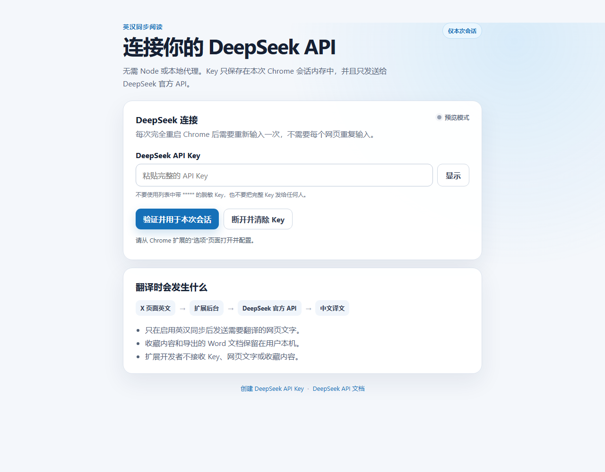

# 英汉同步阅读

一款面向 X（Twitter）的 Chrome 英汉双语阅读扩展。它会在英文内容下方显示中文翻译，并支持划词收藏与 Word（DOCX）导出。

> 当前版本：v0.6.0（实验版）  
> 当前支持：`x.com`、`twitter.com`

## 主要功能

- 英文动态下方同步显示中文翻译
- DeepSeek 作为主要翻译模型
- Chrome 本地翻译模型作为备用方案
- 划词收藏英汉语句
- 将收藏内容导出为 Word（DOCX）文件
- API Key 只保存在浏览器临时会话中，不上传给扩展作者

## 功能展示

### 实时英汉翻译

| 普通动态与视频内容 | 引用动态与长文本 |
| --- | --- |
|  |  |
|  |  |

### 语句收藏与 Word 导出

| 划词收藏 | 导出的 DOCX 文档 |
| --- | --- |
|  |  |

## 安装

1. 打开本仓库的 [Releases](../../releases) 页面。
2. 下载 `x-bilingual-reader-webstore-v0.6.0.zip`。
3. 将 ZIP 完整解压到一个固定文件夹，不要直接选择 ZIP。
4. 在 Chrome 地址栏打开 `chrome://extensions/`。
5. 打开右上角“开发者模式”。
6. 点击“加载已解压的扩展程序”。
7. 选择包含 `manifest.json` 的解压文件夹。

## 设置 DeepSeek

1. 点击浏览器工具栏中的“英汉同步阅读”扩展图标。
2. 粘贴完整的 DeepSeek API Key（通常以 `sk-` 开头）。
3. 点击“验证并保存”。
4. 打开或刷新 X 页面。

API Key 使用 `chrome.storage.session` 保存，只存在于当前浏览器会话中。完全退出 Chrome、重新加载扩展或更新扩展后，需要再次输入。这是为了避免把长期密钥写入磁盘。

## Codex Skill（开发者可选）

仓库中的 [`codex-skill`](codex-skill) 用于让 Codex 创建、修改和检查此类英汉同步阅读扩展，并包含常见故障排查规则。普通浏览器用户不需要安装它。

1. 从 Releases 下载 `bilingual-web-extension-skill-v0.6.0.zip`。
2. 解压后确认目录内直接包含 `SKILL.md`、`scripts` 和 `assets`。
3. 将整个 `bilingual-web-extension` 文件夹放入 Codex 的 Skills 目录。
4. 重新启动 Codex 后，通过 `$bilingual-web-extension` 使用。

这个 Skill 不能通过 `chrome://extensions/` 加载；浏览器插件应下载 `x-bilingual-reader-webstore-v0.6.0.zip`。

## 隐私与费用

- 开启翻译后，待翻译文本会直接从浏览器发送到 DeepSeek API。
- 扩展作者不接收、不保存 API Key 或网页内容。
- 翻译产生的 API 费用由用户自己的 DeepSeek 账户承担。
- 收藏内容保存在浏览器本地，只有用户主动导出时才会生成 DOCX 文件。
- 完整说明见 [PRIVACY.md](PRIVACY.md)。

## 已知限制

- 当前只针对 X/Twitter 页面结构进行适配，其他网站暂不保证可用。
- X 会持续更新页面结构；若部分卡片没有翻译，请提交 Issue 并附上截图。
- 这是未上架 Chrome 应用商店的实验版本，安装时需要开启开发者模式。

## 安全提示

不要把 API Key 写进源码、截图、Issue 或公开仓库。若 Key 曾经公开，请立即在 DeepSeek 控制台删除并重新创建。
