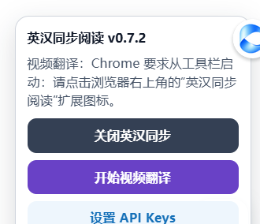
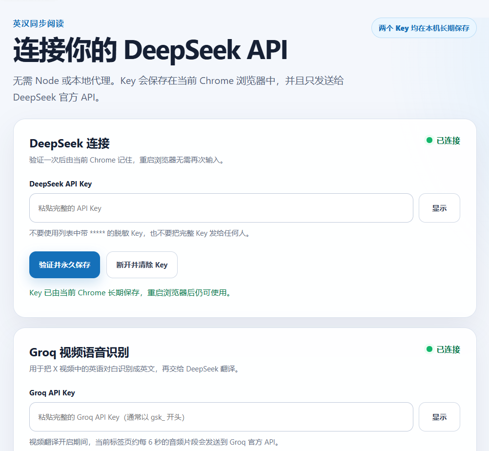
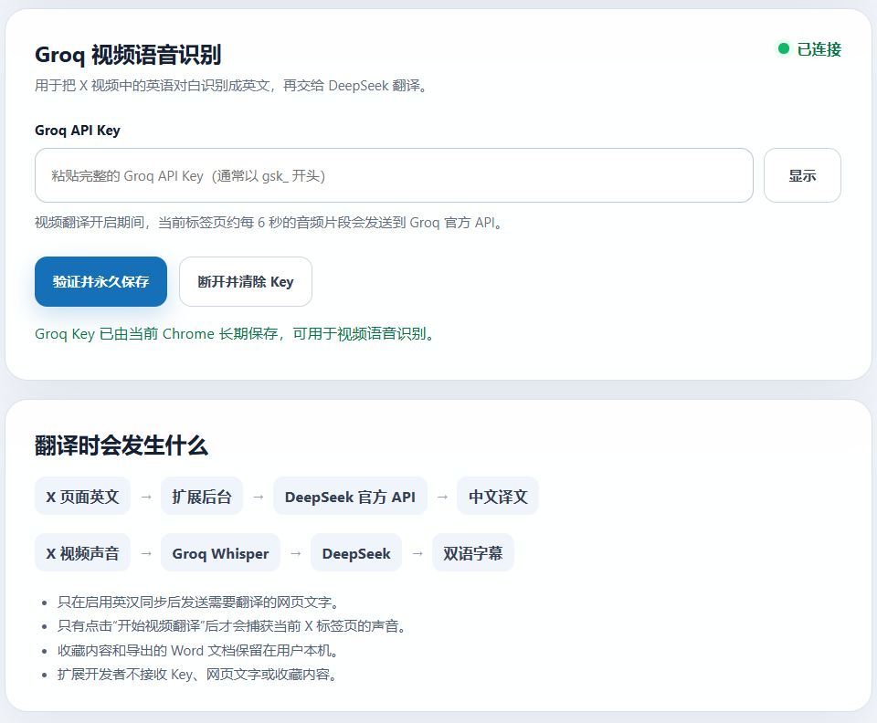
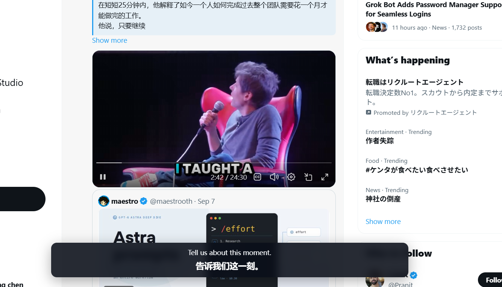
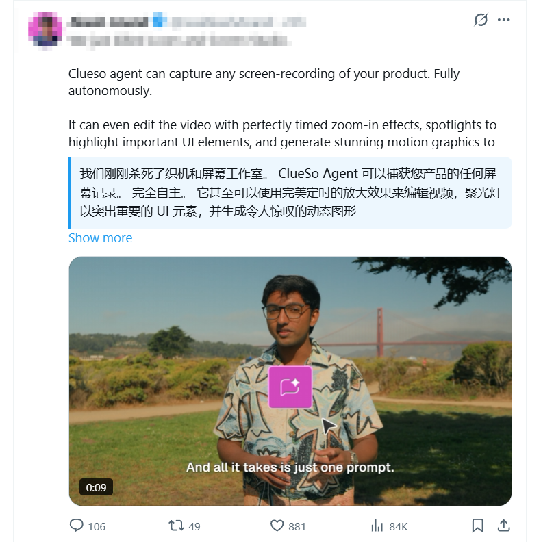
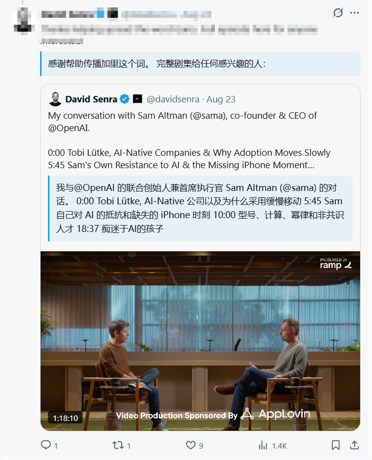
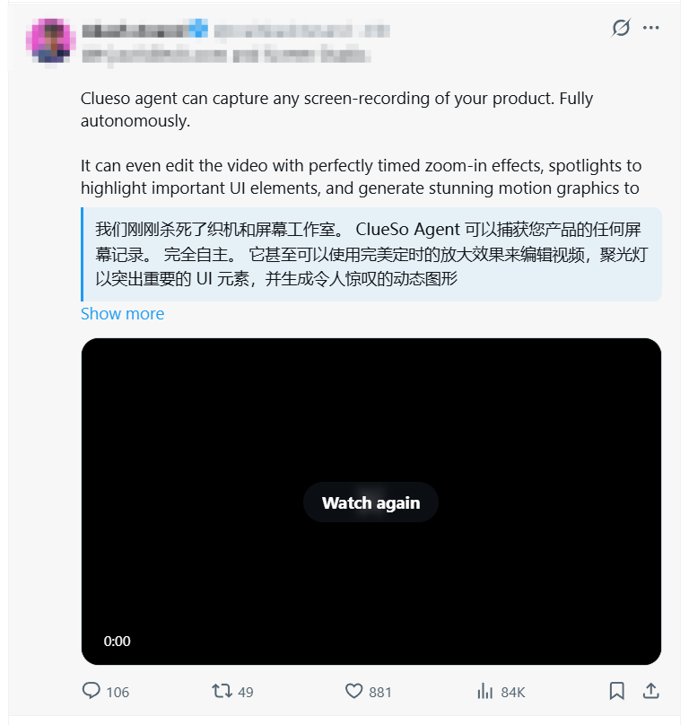
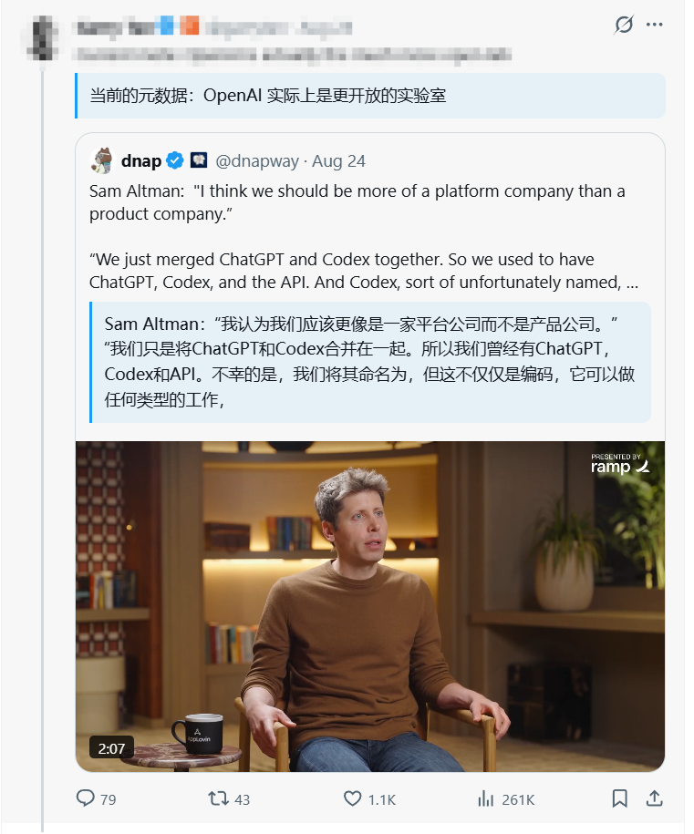
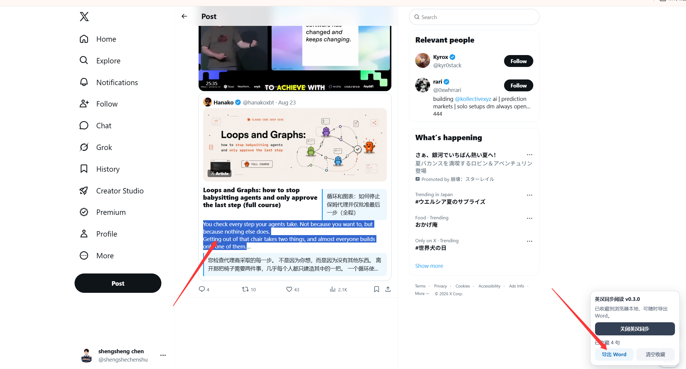
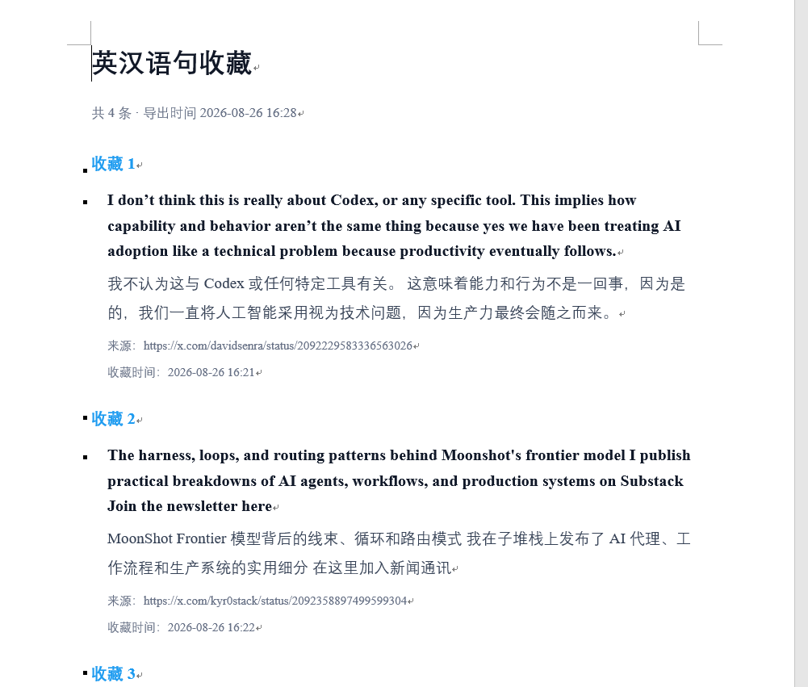

# 英汉同步阅读

一款面向 X（Twitter）的 Chrome 英汉双语阅读扩展。它会在英文内容下方显示中文翻译，并支持划词收藏与 Word（DOCX）导出。

> 当前版本：v0.7.3（实验版）
> 当前支持：`x.com`、`twitter.com`

## 主要功能

- 英文动态下方同步显示中文翻译
- X 文章详情页的标题、正文、小标题、引用和列表同步翻译
- 点击后捕获当前 X 标签页声音，约每 6 秒生成一组英汉双语视频字幕
- 双语字幕条自动跟随当前播放视频，并与视频左右边缘对齐
- DeepSeek 作为主要翻译模型
- Groq Whisper Large V3 Turbo 负责视频英语语音识别
- Chrome 本地翻译模型作为备用方案
- 划词收藏英汉语句
- 将收藏内容导出为 Word（DOCX）文件
- 两个 API Key 均长期保存在当前浏览器中，不上传给扩展作者

## 功能展示

### API 设置

DeepSeek Key 用于英译中，Groq Key 用于视频英语语音识别；Key 验证后长期保存在当前 Chrome 中。

| DeepSeek 与 Groq 连接 | Groq Key 与视频翻译数据流 |
| --- | --- |
|  |  |

### 视频英语对白双语字幕

启动后捕获当前 X 标签页声音：Groq 识别英文对白，DeepSeek 在下方生成中文译文。

### 实时英汉翻译

| 普通动态与视频内容 | 引用动态与长文本 |
| --- | --- |
|  |  |
|  |  |

### X 文章详情翻译

### 语句收藏与 Word 导出

| 划词收藏 | 导出的 DOCX 文档 |
| --- | --- |
|  |  |

## 安装

1. 打开本仓库的 [Releases](../../releases) 页面。
2. 下载 `x-bilingual-reader-webstore-v0.7.3.zip`。
3. 将 ZIP 完整解压到一个固定文件夹，不要直接选择 ZIP。
4. 在 Chrome 地址栏打开 `chrome://extensions/`。
5. 打开右上角“开发者模式”。
6. 点击“加载已解压的扩展程序”。
7. 选择包含 `manifest.json` 的解压文件夹。

## 设置 DeepSeek

1. 点击浏览器工具栏中的“英汉同步阅读”扩展图标。
2. 粘贴完整的 DeepSeek API Key（通常以 `sk-` 开头）。
3. 点击“验证并永久保存”。
4. 打开或刷新 X 页面。

API Key 使用 `chrome.storage.local` 保存在当前 Chrome 的扩展本地存储中。验证一次后，重启浏览器或更新扩展仍可继续使用；只有主动清除、清除扩展数据或卸载扩展后才需要重新输入。Key 不会同步到其他设备。

## 设置并使用视频翻译

1. 在设置页继续粘贴并永久保存自己的 Groq API Key（通常以 `gsk_` 开头）。
2. 打开 X 视频并开始播放，点击 Chrome 工具栏中的“英汉同步阅读”扩展图标启动（页面按钮可用时也可以直接点击）。
3. 首条字幕约 6–9 秒后出现；英文识别结果与中文译文会悬浮显示。
4. 看完后再次点击工具栏扩展图标，或点击页面中的“停止视频翻译”。

视频翻译必须由用户点击后启动，这是 Chrome 的标签页音频权限要求。Groq 只负责把英语声音识别为英文，识别结果再由 DeepSeek 翻译为中文。每个音频片段约 6 秒，因此它是近实时字幕，不是逐字即时字幕。Groq 对不足 10 秒的音频仍按最低 10 秒计费，这是降低字幕延迟的成本。

## Codex Skill（开发者可选）

仓库中的 [`codex-skill`](codex-skill) 用于让 Codex 创建、修改和检查此类英汉同步阅读扩展，并包含常见故障排查规则。普通浏览器用户不需要安装它。

1. 从 Releases 下载 `bilingual-web-extension-skill-v0.7.3.zip`。
2. 解压后确认目录内直接包含 `SKILL.md`、`scripts` 和 `assets`。
3. 将整个 `bilingual-web-extension` 文件夹放入 Codex 的 Skills 目录。
4. 重新启动 Codex 后，通过 `$bilingual-web-extension` 使用。

这个 Skill 不能通过 `chrome://extensions/` 加载；浏览器插件应下载 `x-bilingual-reader-webstore-v0.7.3.zip`。

## 隐私与费用

- 开启翻译后，待翻译文本会直接从浏览器发送到 DeepSeek API。
- 开启视频翻译后，当前标签页音频片段会发送到 Groq API 进行英语语音识别。
- 扩展作者不接收、不保存 API Key 或网页内容。
- 翻译和语音识别费用分别由用户自己的 DeepSeek、Groq 账户承担。
- 收藏内容保存在浏览器本地，只有用户主动导出时才会生成 DOCX 文件。
- 完整说明见 [PRIVACY.md](PRIVACY.md)。

## 已知限制

- 当前只针对 X/Twitter 页面结构进行适配，其他网站暂不保证可用。
- 视频字幕约每 6 秒更新，并非逐字即时；背景噪声、口音和音乐可能降低识别准确率。
- X 会持续更新页面结构；若部分卡片没有翻译，请提交 Issue 并附上截图。
- 这是未上架 Chrome 应用商店的实验版本，安装时需要开启开发者模式。

## 安全提示

不要把 API Key 写进源码、截图、Issue 或公开仓库。若 Key 曾经公开，请立即在 DeepSeek 控制台删除并重新创建。
